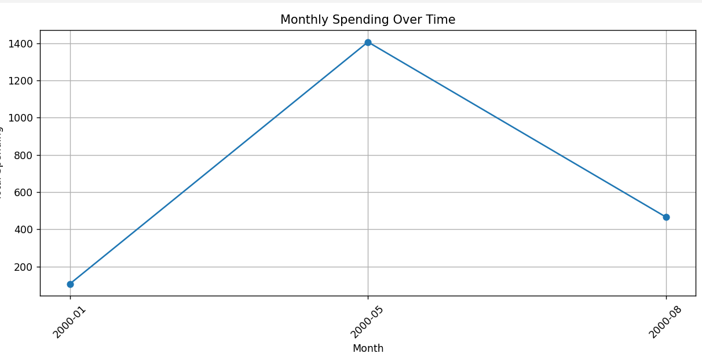
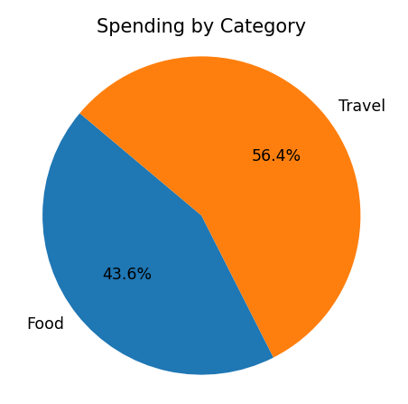
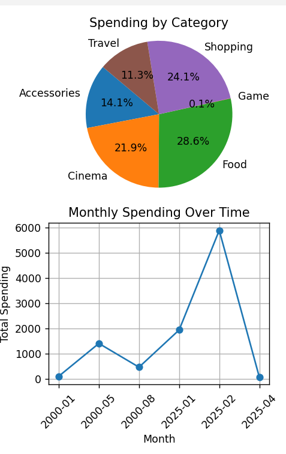

## **EXPENSE TRACKER**
      Track your expenses and visualize spending patterns using Python and Matplotlib.

### **Techs used**
        Python
        Matplotlib
        Reportlab
        SQLite

### **Core features**
        Add,Update,View and Delete expenses
        Datas store in SQLite db
        Monthly spending chart(line graph)
        Category wise spending(Pie chart)
        Export report to PDF
        User login

### **Setup**
        'git clone https://github.com/Hashif228/Elevate/tree/main/Expense_tracker'
        'pip install -r requirements.txt'
        'python expense.py' in terminal
        Follow the instructions seeing in terminal

### **Screenshots**

